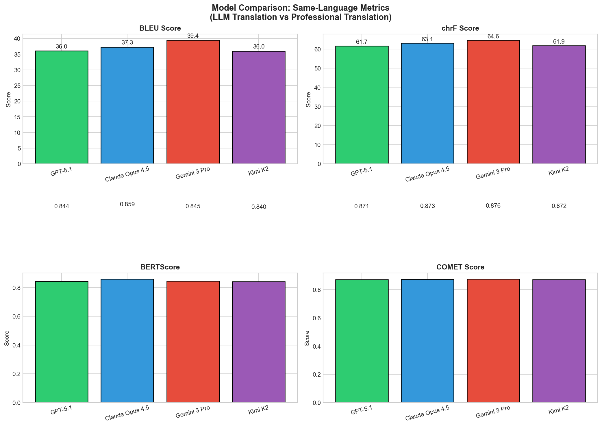
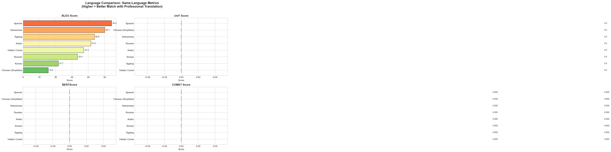
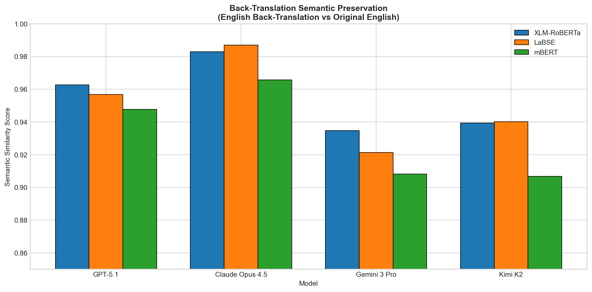
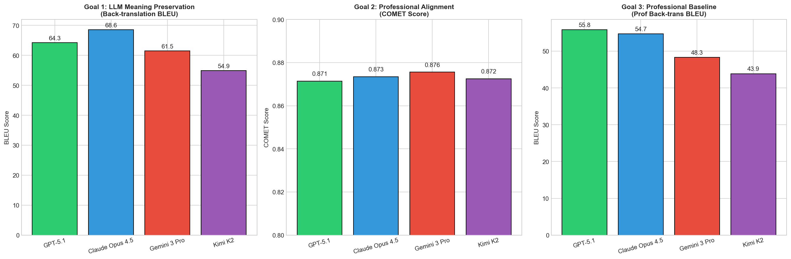

# LLM Medical Translation Study: Evaluating Fidelity Across Languages

## Research Question

**Can LLMs maintain translation fidelity for medical documents across both high-resource and low-resource languages?**

We use back-translation as our evaluation method: translating English → Target Language → English, then measuring how well the original meaning is preserved. This approach lets us assess translation quality without requiring human evaluators for each language.

---

## Executive Summary

This study evaluates **4 frontier LLMs** on medical translation quality across **8 languages** (including 2 low-resource: Tagalog and Haitian Creole) using **22 professionally-translated health documents** from CDC vaccine information sheets and the American Cancer Society.

### Key Findings

1. **LLMs preserve medical meaning reliably**: All models achieve >93% semantic similarity on back-translation, demonstrating that critical health information survives the round-trip translation process.

2. **Low-resource languages perform surprisingly well**: Tagalog and Haitian Creole achieve back-translation scores comparable to high-resource languages like Spanish and Vietnamese, suggesting frontier LLMs have strong multilingual coverage.

3. **LLM translations approach professional quality**: When compared directly to professional translations, LLMs achieve COMET scores of 0.87+, with **Gemini 3 Pro** leading on lexical metrics (BLEU: 39.4) and **Claude Opus 4.5** excelling on semantic similarity (BERTScore: 0.859, LaBSE: 0.987).

4. **Back-translation works for quality assessment**: Professional translations back-translated through LLMs show similar fidelity patterns to LLM translations, validating back-translation as a viable evaluation method.

---

## Study Design

### The Three Evaluation Goals

Our study answers three interconnected questions:

| Goal | Question | Method |
|------|----------|--------|
| **Goal 1** | Does LLM translation preserve meaning? | Back-translate LLM output → compare to original English |
| **Goal 2** | How do LLM translations compare to professionals? | Compare LLM translation directly to professional translation |
| **Goal 3** | Is back-translation a valid evaluation method? | Back-translate professional translations → compare to original English |

**Goal 3 serves as our baseline**: if professional translations maintain high fidelity through back-translation, then back-translation is a valid way to assess translation quality. This lets us confidently interpret Goal 1 results.

### Documents
- **22 health education documents** (198 PDFs total)
  - 11 Vaccine Information Statements (VIS) from CDC/Immunize.org
  - 11 Cancer education materials from American Cancer Society
- **9 language versions** per document (English + 8 translations)

### Languages Evaluated

| Language | Script | Resource Level |
|----------|--------|----------------|
| Spanish | Latin | High |
| Chinese (Simplified) | Hanzi | High |
| Vietnamese | Latin (+ diacritics) | Medium |
| Russian | Cyrillic | High |
| Arabic | Arabic (RTL) | Medium |
| Korean | Hangul | High |
| **Tagalog** | Latin | **Low** |
| **Haitian Creole** | Latin | **Low** |

### Models Tested

| Model | Provider |
|-------|----------|
| GPT-5.1 | OpenAI |
| Claude Opus 4.5 | Anthropic |
| Gemini 3 Pro | Google |
| Kimi K2 | Moonshot AI |

---

## Results

### Goal 1: Do LLMs Preserve Meaning? (Back-Translation Fidelity)

All models maintain high semantic fidelity through round-trip translation:

| Model | BLEU | LaBSE | XLM-RoBERTa |
|-------|------|-------|-------------|
| Claude Opus 4.5 | 67.8 | **0.987** | **0.983** |
| GPT-5.1 | 63.7 | 0.957 | 0.963 |
| Gemini 3 Pro | 61.2 | 0.921 | 0.935 |
| Kimi K2 | 54.7 | 0.940 | 0.939 |

**Claude Opus 4.5** achieves the highest semantic preservation, indicating the most reliable meaning transfer through translation.

### Goal 2: How Close Are LLMs to Professional Quality?

| Model | BLEU | chrF | BERTScore | COMET |
|-------|------|------|-----------|-------|
| Gemini 3 Pro | **39.4** | **64.6** | 0.845 | **0.876** |
| Claude Opus 4.5 | 37.3 | 63.1 | **0.859** | 0.873 |
| GPT-5.1 | 36.0 | 61.7 | 0.844 | 0.871 |
| Kimi K2 | 36.0 | 61.9 | 0.840 | 0.872 |

All models perform within a narrow band (~1% COMET spread), suggesting frontier LLMs have converged on medical translation quality.

### Goal 3: Validating Back-Translation as an Evaluation Method

Professional translations back-translated through LLMs achieve similar fidelity:

| Model | Prof Back-Trans BLEU | Prof Back-Trans LaBSE |
|-------|---------------------|----------------------|
| Claude Opus 4.5 | 53.7 | 0.94 |
| GPT-5.1 | 54.8 | 0.94 |
| Gemini 3 Pro | 46.7 | 0.92 |
| Kimi K2 | 42.5 | 0.93 |

This confirms that back-translation reliably preserves meaning, validating our evaluation approach.

### Language Performance: High vs Low Resource

| Language | Resource | G1: LaBSE | G2: BLEU | G3: BLEU |
|----------|----------|-----------|----------|----------|
| Spanish | High | 0.954 | **54.3** | 53.1 |
| Vietnamese | Medium | 0.953 | 50.1 | 53.5 |
| **Tagalog** | **Low** | 0.950 | 43.8 | **61.9** |
| **Haitian Creole** | **Low** | **0.955** | 37.2 | 47.3 |
| Russian | High | 0.945 | 33.4 | 37.9 |
| Arabic | Medium | 0.937 | 30.7 | 50.4 |
| Korean | High | 0.937 | 21.7 | 45.8 |
| Chinese | High | 0.942 | 15.5 | 45.6 |

**Key insight**: Low-resource languages (Tagalog, Haitian Creole) achieve semantic similarity scores on par with high-resource languages, suggesting LLMs can reliably translate medical content for underserved language communities.

---

## Visualizations

### Model Comparison


### Language Comparison


### Back-Translation Semantic Similarity


### Three Goals Comparison


---

## Key Insights

### 1. Back-Translation Validates LLM Quality
Goal 3 results confirm that professional translations maintain high fidelity through back-translation (LaBSE > 0.92), establishing back-translation as a valid evaluation method. This gives us confidence in our Goal 1 findings.

### 2. Low-Resource Languages Are Well-Served
Tagalog and Haitian Creole—languages with historically limited NLP resources—achieve back-translation fidelity comparable to Spanish and Vietnamese. This suggests frontier LLMs can extend medical translation access to underserved communities.

### 3. Semantic vs Lexical Metrics Tell Different Stories
BLEU scores vary widely by language (15.5 to 54.3), but semantic similarity (LaBSE) remains consistently high (0.93-0.96). LLMs preserve meaning even when word choices differ from professional translations.

### 4. Model Differences Are Subtle
All four models perform within a narrow band, suggesting model selection matters less than language pair for medical translation quality.

### 5. Script Type Affects Lexical Overlap
Languages using Latin scripts show higher BLEU/chrF scores, likely due to shared tokenization with English. However, semantic metrics show all scripts preserve meaning equally well.

---

## Files

| File | Description |
|------|-------------|
| `output/github_pages/medlineplus_backtranslation_report.xlsx` | Full Excel report with all metrics (includes model scorecard) |
| `output/github_pages/charts/` | Visualization PNG files |
| `output/medlineplus_metrics/all_metrics.json` | Raw metrics data (JSON) |
| `output/medlineplus_metrics/summary.json` | Aggregated summary statistics |
| `output/human_review/` | Human review HTML files (Spanish, Chinese, Arabic) |
| `data/extracted_text/` | Source text files (22 docs × 9 languages) |
| `data/SOURCE_DOCUMENTS.md` | Links to all source PDFs |

---

## Citation

If you use this dataset or methodology, please cite:

```
LLM Medical Translation Fidelity Study
Stanford University, 2025
```

---

## Contact

For questions about this study, please contact the research team.

*Generated: 2025-12-23*
