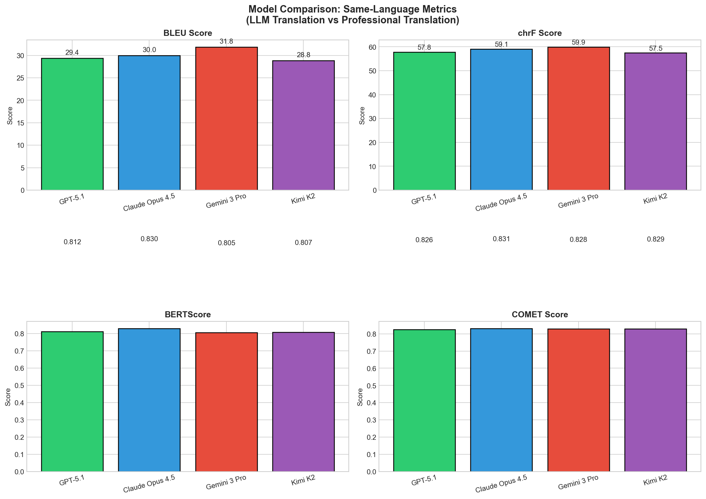
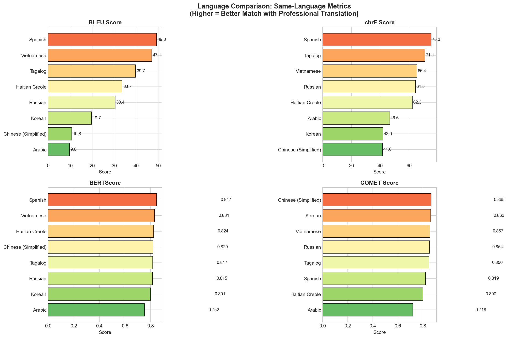
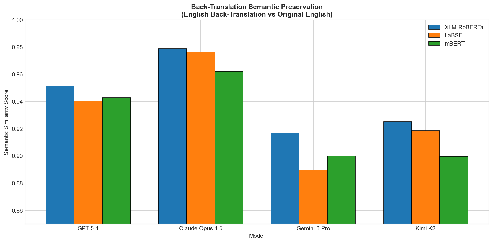
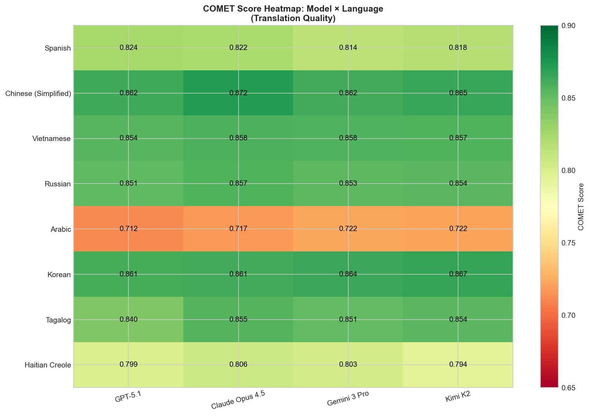

# MedlinePlus Back-Translation Evaluation Study

## Executive Summary

This study evaluates **4 frontier LLMs** on medical translation quality across **8 languages** using **22 professionally-translated health documents** from MedlinePlus (CDC vaccine information) and the American Cancer Society.

### Key Findings

1. **All models achieve high semantic preservation** (>92% back-translation similarity), indicating LLMs reliably preserve medical meaning through round-trip translation.

2. **Claude Opus 4.5** achieves the highest translation quality (COMET: 0.831), while **Gemini 3 Pro** leads in lexical overlap (BLEU: 31.8).

3. **Chinese (Simplified)** shows the strongest LLM-professional agreement (COMET: 0.865), while **Arabic** remains most challenging (COMET: 0.718).

4. **Script complexity matters**: Languages using Latin script (Spanish, Vietnamese, Tagalog) consistently outperform those with non-Latin scripts (Arabic, Chinese, Korean).

---

## Study Design

### Documents
- **22 health education documents** (198 PDFs total)
  - 11 Vaccine Information Statements (VIS) from CDC/Immunize.org
  - 11 Cancer education materials from American Cancer Society
- **9 language versions** per document (English + 8 translations)

### Languages Evaluated
| Language | Script | Resource Level |
|----------|--------|----------------|
| Spanish | Latin | High |
| Chinese (Simplified) | Hanzi | High |
| Vietnamese | Latin (+ diacritics) | Medium |
| Russian | Cyrillic | High |
| Arabic | Arabic (RTL) | Medium |
| Korean | Hangul | High |
| Tagalog | Latin | Low |
| Haitian Creole | Latin | Low |

### Models Tested
| Model | Provider |
|-------|----------|
| GPT-5.1 | OpenAI |
| Claude Opus 4.5 | Anthropic |
| Gemini 3 Pro | Google |
| Kimi K2 | Moonshot AI |

---

## Methodology

### Translation Pipeline
1. **Forward Translation**: English → Target Language (LLM)
2. **Back-Translation**: Target Language → English (LLM)
3. **Evaluation**: Compare LLM output vs professional translations

### Metrics

#### Same-Language Metrics (LLM vs Professional Translation)
| Metric | Description | Range |
|--------|-------------|-------|
| BLEU | N-gram overlap | 0-100 |
| chrF | Character n-gram F-score | 0-100 |
| BERTScore | Contextual embedding similarity | 0-1 |
| COMET | Neural translation quality | 0-1 |

#### Back-Translation Semantic Metrics (LLM Back-Translation vs Original English)
These metrics compare the English back-translation to the original English text, measuring how well meaning is preserved through the round-trip translation. Despite using multilingual models (for robustness), this is an **English-to-English comparison**.

| Metric | Description | Range |
|--------|-------------|-------|
| XLM-RoBERTa | Semantic similarity (multilingual encoder) | 0-1 |
| LaBSE | Sentence embedding similarity | 0-1 |
| mBERT | Contextual embedding similarity | 0-1 |
| COMET-QE | Reference-free quality estimation | -1 to 1 |

---

## Results

### Model Performance Summary

| Model | BLEU | chrF | BERTScore | COMET |
|-------|------|------|-----------|-------|
| Gemini 3 Pro | **31.8** | **59.9** | 0.805 | 0.828 |
| Claude Opus 4.5 | 30.0 | 59.1 | **0.830** | **0.831** |
| GPT-5.1 | 29.4 | 57.8 | 0.812 | 0.826 |
| Kimi K2 | 28.8 | 57.5 | 0.807 | 0.829 |

### Language Performance Summary

| Language | BLEU | chrF | BERTScore | COMET |
|----------|------|------|-----------|-------|
| Spanish | **49.3** | **75.3** | **0.847** | 0.819 |
| Vietnamese | 47.1 | 65.4 | 0.831 | 0.857 |
| Tagalog | 39.7 | 71.1 | 0.817 | 0.850 |
| Haitian Creole | 33.7 | 62.3 | 0.824 | 0.800 |
| Russian | 30.4 | 64.5 | 0.815 | 0.854 |
| Korean | 19.7 | 42.0 | 0.801 | **0.863** |
| Chinese | 10.8 | 41.6 | 0.820 | 0.865 |
| Arabic | 9.6 | 46.6 | 0.752 | 0.718 |

---

## Visualizations

### Model Comparison


### Language Comparison


### Back-Translation Semantic Similarity


### COMET Score Heatmap


---

## Key Insights

### 1. Model Differentiation is Subtle
All four frontier models perform within a narrow band (~3% COMET spread), suggesting that for medical translation, model selection is less critical than language pair selection.

### 2. Script Type Dominates Performance
Languages using Latin-based scripts (Spanish, Vietnamese, Tagalog, Haitian Creole) consistently show higher BLEU/chrF scores, likely due to shared tokenization advantages with English training data.

### 3. Semantic Metrics Tell a Different Story
While BLEU varies widely by language (9.6 to 49.3), COMET scores are more consistent (0.72 to 0.87), suggesting LLMs preserve meaning even when surface forms differ from professional translations.

### 4. Low-Resource Languages Hold Their Own
Tagalog and Haitian Creole—traditionally considered low-resource—achieve competitive scores, indicating frontier LLMs have strong coverage of these languages.

### 5. Arabic Remains Challenging
Arabic shows the lowest same-language scores across all metrics, reflecting the compound challenges of RTL script, morphological complexity, and potential training data imbalances.

---

## Files

| File | Description |
|------|-------------|
| `medlineplus_backtranslation_report.xlsx` | Full Excel report with all metrics |
| `charts/` | Visualization PNG files |
| `all_metrics.json` | Raw metrics data (JSON) |
| `summary.json` | Aggregated summary statistics |
| `PIPELINE_REVIEW.md` | Technical documentation for NLP review |

---

## Human Review Materials

We have prepared side-by-side comparisons for bilingual reviewers:

| Language | Review File | Documents Selected |
|----------|-------------|-------------------|
| Chinese (Simplified) | `human_review/review_chinese_simplified.html` | 2 documents with highest model variance |
| Spanish | `human_review/review_spanish.html` | 2 documents with highest model variance |

### Review Instructions
1. Open the HTML file in a browser
2. Compare Professional Translation vs LLM Translation side-by-side
3. Check for: accuracy, fluency, medical terminology, cultural appropriateness
4. Review back-translation vs original English for semantic preservation
5. Note any issues: missing info, mistranslations, errors

---

## NLP Pipeline Review

For technical review of the evaluation pipeline, see [PIPELINE_REVIEW.md](PIPELINE_REVIEW.md).

This document covers:
- Pipeline architecture
- Metric implementations (BLEU, chrF, BERTScore, COMET, XLM-RoBERTa, LaBSE, etc.)
- Data flow and code locations
- Known limitations
- Validation checklist

---

## Citation

If you use this dataset or methodology, please cite:

```
MedlinePlus Back-Translation Evaluation Study
Stanford University, 2025
```

---

## Contact

For questions about this study, please contact the research team.

*Generated: 2025-12-14 19:33*
