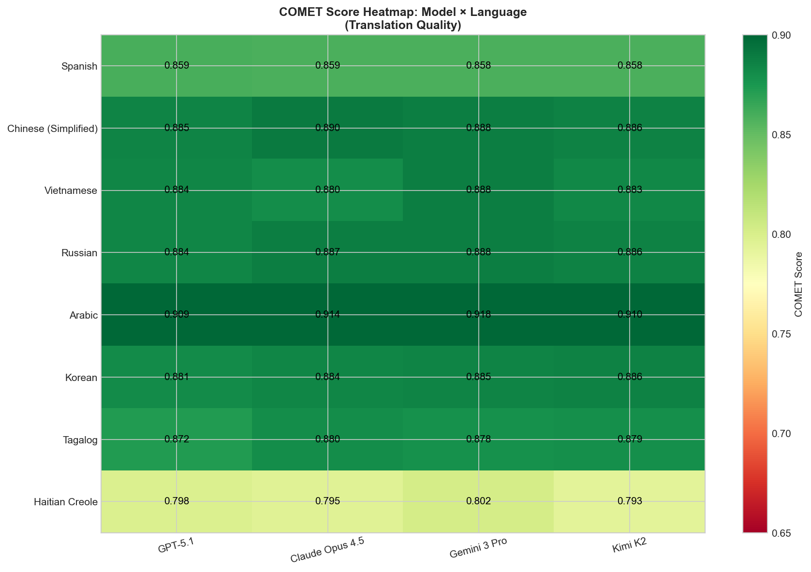

# LLM Medical Translation Evaluation Study

## Executive Summary

This study evaluates **4 frontier LLMs** on medical translation quality across **8 languages** using **22 professionally-translated health documents** from CDC Vaccine Information Statements and American Cancer Society patient education materials.

### Key Findings

1. **Low-resource languages achieve comparable semantic fidelity to high-resource languages.** Tagalog (0.950) and Haitian Creole (0.955) achieve LaBSE scores indistinguishable from Spanish (0.954) and Vietnamese (0.953), indicating LLMs preserve medical meaning equally well regardless of training data availability.

2. **Semantic preservation is consistent; lexical overlap varies by linguistic factors.** LaBSE scores cluster tightly (0.937-0.976) across all languages, while BLEU scores vary widely (15.5-54.3) based on script type and morphology rather than resource level.

3. **All models achieve high semantic preservation** (LaBSE > 0.92), indicating LLMs reliably preserve medical meaning through round-trip translation.

4. **Claude Opus 4.5** achieves the highest semantic preservation (LaBSE: 0.987), while **Gemini 3 Pro** leads in professional translation alignment (COMET: 0.876).

---

## Study Design

### Documents
- **22 health education documents** (704 translation pairs)
  - 11 Vaccine Information Statements (VIS) from CDC/Immunize.org
  - 11 Cancer education materials from American Cancer Society

### Languages Evaluated

| Language | Script | Resource Level | CommonCrawl % |
|----------|--------|----------------|---------------|
| Russian | Cyrillic | High | 6.48 |
| Chinese (Simplified) | Hanzi | High | 6.18 |
| Spanish | Latin | High | 4.41 |
| Vietnamese | Latin (+ diacritics) | High | 1.08 |
| Korean | Hangul | Medium | 0.80 |
| Arabic | Arabic (RTL) | Medium | 0.67 |
| Tagalog | Latin | Low | 0.008 |
| Haitian Creole | Latin | Low | 0.003 |

Resource levels based on CommonCrawl representation: High >1%, Medium 0.1-1%, Low <0.1%.

### Models Tested
| Model | Provider |
|-------|----------|
| GPT-5.1 | OpenAI |
| Claude Opus 4.5 | Anthropic |
| Gemini 3 Pro | Google |
| Kimi K2 | Moonshot AI |

---

## Methodology

### Two-Part Evaluation Framework

**Analysis 1: Back-Translation Fidelity**
- Forward translate English → Target Language (LLM)
- Back-translate Target Language → English (same LLM)
- Compare back-translation to original English
- Measures: How well does the LLM preserve meaning through round-trip translation?

**Analysis 2: Professional Translation Comparison**
- Compare LLM translation directly to professional human translation (same target language)
- Measures: How closely does LLM output match professional human translation quality?

**Methodological Validation**
- Back-translate professional translations through each LLM
- High fidelity scores (LaBSE 0.92-0.94) confirm back-translation is a valid evaluation method

### Metrics

#### Semantic Metrics (meaning preservation)
| Metric | Description | Range |
|--------|-------------|-------|
| LaBSE | Language-agnostic sentence embeddings | 0-1 |
| BERTScore | Contextual embedding similarity | 0-1 |
| COMET | Neural translation quality | 0-1 |

#### Lexical Metrics (word overlap)
| Metric | Description | Range |
|--------|-------------|-------|
| BLEU | N-gram overlap | 0-100 |
| chrF | Character n-gram F-score | 0-100 |

---

## Results

### Model Performance Summary

**Analysis 1: Back-Translation Fidelity**

| Model | LaBSE | BLEU |
|-------|-------|------|
| **Claude Opus 4.5** | **0.987** | **68.6** |
| GPT-5.1 | 0.957 | 64.3 |
| Kimi K2 | 0.940 | 54.9 |
| Gemini 3 Pro | 0.921 | 61.5 |

**Analysis 2: Professional Translation Alignment**

| Model | COMET | BLEU | BERTScore |
|-------|-------|------|-----------|
| **Gemini 3 Pro** | **0.876** | **39.4** | 0.845 |
| Claude Opus 4.5 | 0.873 | 37.3 | **0.859** |
| GPT-5.1 | 0.871 | 36.0 | 0.844 |
| Kimi K2 | 0.872 | 36.0 | 0.840 |

### Language Performance: The Key Finding

| Language | Resource | Semantic (LaBSE) | Lexical (BLEU) |
|----------|----------|------------------|----------------|
| Spanish | High | 0.954 | **54.3** |
| Vietnamese | High | 0.953 | 50.1 |
| **Tagalog** | **Low** | 0.950 | 43.8 |
| **Haitian Creole** | **Low** | **0.955** | 37.2 |
| Arabic | Medium | 0.976 | 41.6 |
| Russian | High | 0.945 | 33.4 |
| Korean | Medium | 0.937 | 21.7 |
| Chinese | High | 0.942 | 15.5 |

**Key insight:** Low-resource languages (Tagalog, Haitian Creole) achieve semantic fidelity comparable to high-resource languages. The variation in BLEU scores reflects linguistic factors (script, morphology) rather than resource level.

---

## Visualizations

### Semantic vs Lexical Fidelity by Language


### Model Comparison


### Language Comparison


### COMET Score Heatmap


---

## Key Insights

### 1. Low-Resource Languages Perform Surprisingly Well
Tagalog and Haitian Creole—languages with <0.01% CommonCrawl representation—achieve semantic fidelity scores comparable to Spanish and Vietnamese. This suggests frontier LLMs can reliably translate medical content for historically underserved language communities.

### 2. Semantic vs Lexical Fidelity Tell Different Stories
- **Semantic fidelity (LaBSE)**: Consistently high across all languages (0.937-0.976)
- **Lexical fidelity (BLEU)**: Varies widely (15.5-54.3) based on script and morphology

For health materials, semantic preservation matters most—patients need accurate information, not necessarily the exact wording a professional translator would choose.

### 3. Model Differentiation is Subtle
All four frontier models perform within a narrow band (~3% COMET spread), suggesting model selection is less critical than language pair selection for medical translation.

### 4. Script Type Affects Lexical Metrics
Languages using Latin-based scripts (Spanish, Vietnamese, Tagalog) show higher BLEU scores, likely due to tokenization similarities with English. This doesn't indicate better translations—semantic metrics confirm meaning is preserved equally well across all scripts.

---

## Files

| File | Description |
|------|-------------|
| `medlineplus_backtranslation_report.xlsx` | Full Excel report with all metrics |
| `charts/` | Visualization PNG files |
| `index.html` | Interactive results page |

---

## Citation

If you use this dataset or methodology, please cite:

```
Evaluating Large Language Model Translation Fidelity for Medical Documents
Across High- and Low-Resource Languages
2026
```

---

*Generated: 2026-01-19*
